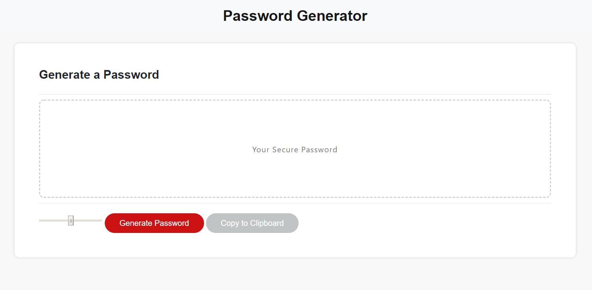
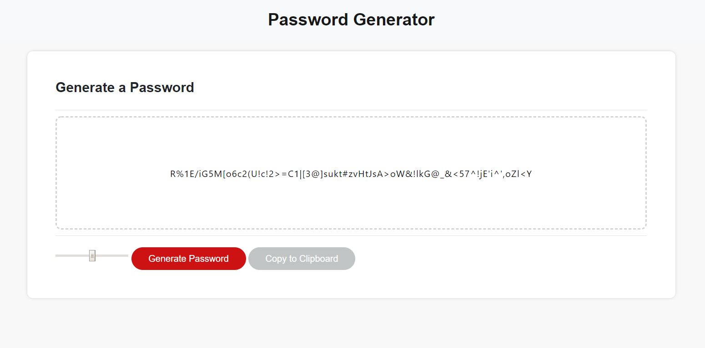
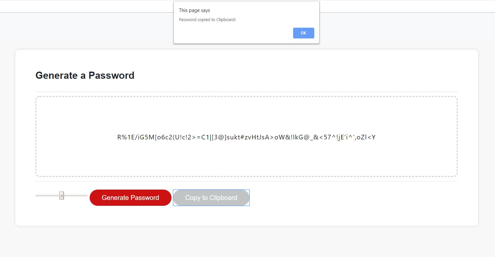
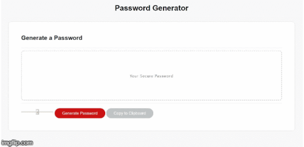

# Product Name
> Random Password Generator

This is a random password generator with optional user configurable slider to choose a password character length. This app will run in the browser and feature dynamically updated HTML and CSS powered by JavaScript code.

## Screenshots

## User Story

AS AN employee with access to sensitive data

I WANT to randomly generate a password that meets certain criteria

SO THAT I can create a strong password that provides greater security

## Business Context

For companies that handle large amounts of sensitive data, weak passwords can pose a real security threat. An application that can generate strong passwords quickly and effortlessly saves employees time and ensures secure access to data.

## Acceptance Criteria

GIVEN that a user needs a new, secure password

WHEN user used a slider to select length of password

THEN a password is generated

ADDITIONALLY user can easily copy a password by clicking copy to clipboard button
- - -

## Meta

[Password Generator](https://github.com/boohordekiller/week3-hw-passwordGenerator)

